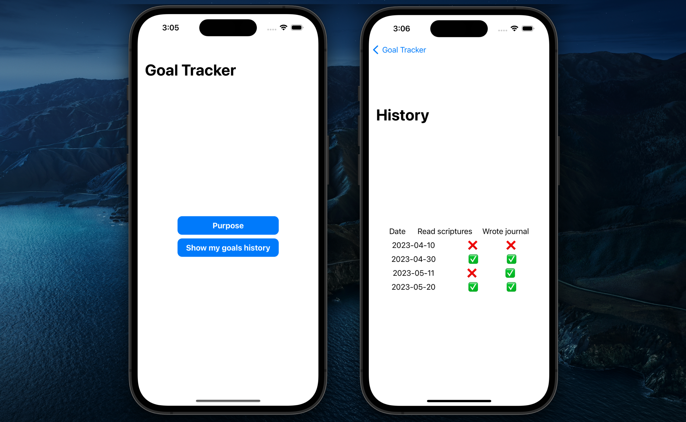

# Overview

The purpose of this Cloud Goal Tracker iOS application is to help you to achieve your goals through gamification (turning your goals into a game). This software retrieves information saved in a cloud database and shows the history of achievements on the mobile screen.

At this development stage, the interface contains two buttons to display the purpose of this software and the updated information from a [AWS cloud database](https://docs.aws.amazon.com/dynamodb/).

This software is an extension of my previous project [Cloud Goal Tracker](https://github.com/chinchay/cloud-goal-tracker) from a standalone to a mobile version.

The [Software Demo Video](https://youtu.be/VwgcSzqtqEw) contains a demonstration of the app running and a walkthrough of the code.




# Development Environment

* Xcode 14.3 for the app development. It is possible to use VScode though.
* [CocoaPods](https://cocoapods.org/)
* [AWS SDK for iOS](https://github.com/aws-amplify/aws-sdk-ios). Particularly, I have used the following procedure to add the AWS dependencies:
    * Create a Podfile    

        ```ShellSession
        $ pod init
        ```

    * Include the dependencies in the new `Podfile` created

        ```ShellSession
        pod "AWSCore"
        pod "AWSDynamoDB"  
        pod "AWSCognitoIdentityProvider"
        ```

    * CocoaPods will install the dependencies

        ```properties
        $ pod install --repo-update
        ```

    * Instead of opening your project from Xcode, type instead:

        ```ShellSession
        $ xed .
        ```

# Useful Websites

* [Swift & DynamoDB](https://www.robhageboeck.com/examples/swiftuidynamodb.php)
* [Buttons and Actions - Your First iOS and SwiftUI App with Xcode](https://www.youtube.com/watch?v=Xy_CtlR-hpM&ab_channel=Kodeco)
* [Build Your FIRST iOS App For Beginners (2023) – Tutorial](https://www.youtube.com/watch?v=nqTcAzPS3oc&ab_channel=iOSAcademy)
* [iOS Development](https://www.youtube.com/@CodeWithChris/videos)

# Future Work

This is still a simple app with two buttons to interact with the user. More features are coming, including:
* Add, deleete, and update daily goals
* Use a safer authentication process instead of hardcored AWS credentials
* Improve interface and visualizations